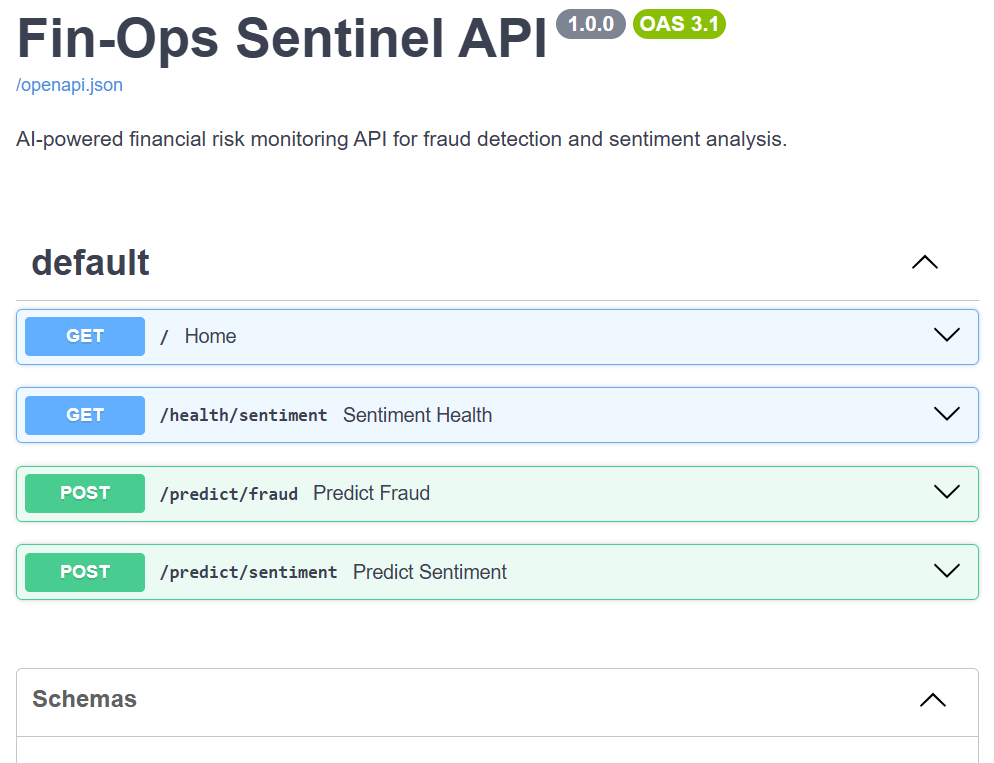
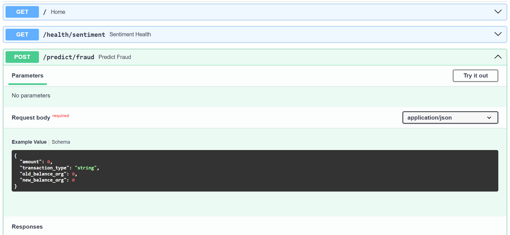
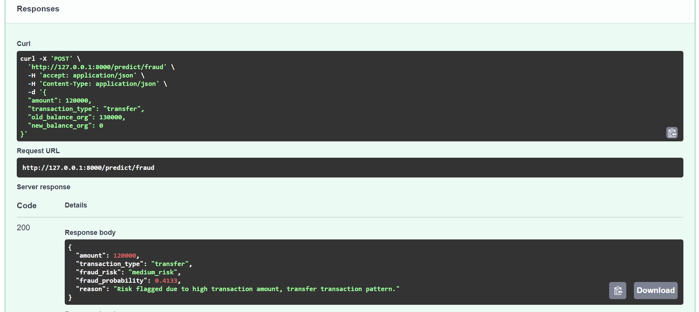
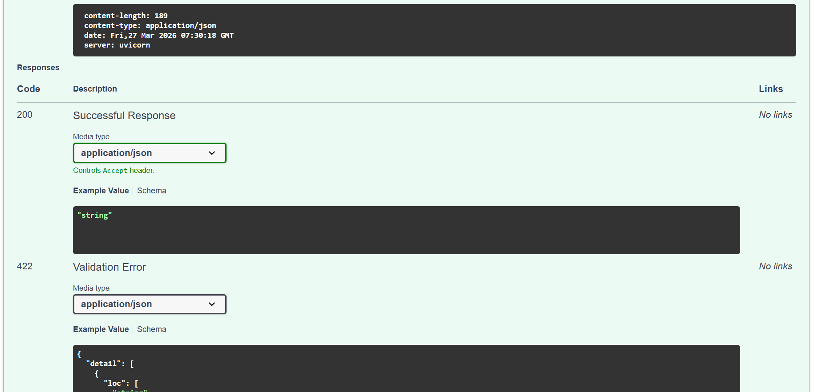

# Fin-Ops Sentinel

Fin-Ops Sentinel is a containerized FastAPI-based financial risk monitoring API that combines fraud detection and financial sentiment analysis into production-style machine learning services.

This project was built to demonstrate how machine learning models can move beyond notebook experiments and be deployed as structured, reusable APIs for operational decision support.

---

## Project Overview

Fin-Ops Sentinel simulates a real-world financial operations workflow where transaction activity and financial text signals can be analysed through API endpoints.

The system currently provides:

- fraud risk prediction for transaction-style input data
- fraud explanation generation for flagged transactions
- financial sentiment analysis for business and market-related text
- interactive API documentation with FastAPI Swagger UI
- containerized deployment with Docker

This project is designed as a recruiter-facing portfolio project that highlights practical skills in machine learning deployment, backend API engineering, model serving, request validation, and modular project structure.

---

## System Architecture

Fin-Ops Sentinel follows a modular API-first architecture for serving machine learning predictions in a production-style workflow.

### High-Level Flow

1. Client sends a request to a FastAPI endpoint  
2. Request data is validated using Pydantic schemas  
3. The relevant fraud or sentiment module processes the input  
4. The model returns prediction results  
5. The API formats the response into a structured JSON output  
6. Docker provides a portable runtime environment for local deployment and demonstration

### Architecture Summary

- **FastAPI** handles routing and API documentation
- **Pydantic** validates request payloads
- **Fraud module** handles transaction preprocessing, scoring, and explanation generation
- **Sentiment module** handles financial text sentiment inference
- **Model artifacts** are loaded from the `models/` directory
- **Docker** ensures consistent environment setup across machines

### Request-to-Response Flow

```text
Client Request
    │
    ▼
FastAPI Endpoint
    │
    ▼
Pydantic Validation
    │
    ▼
Prediction Module
 ┌───────────────┬────────────────┐
 │ Fraud Engine  │ Sentiment Engine │
 └───────────────┴────────────────┘
    │
    ▼
Model Inference / Rule Logic
    │
    ▼
Structured JSON Response
```
---

## Why I Built This Project

Many machine learning projects stop at model training inside notebooks. I wanted to build something closer to how AI systems are used in practice.

With Fin-Ops Sentinel, the focus is not just on prediction, but on:

- exposing models through clean API endpoints
- structuring code in a modular and maintainable way
- returning interpretable outputs for decision support
- preparing the application for containerized deployment
- presenting the project in a way that reflects production-minded engineering

---

## Key Features

### 1. Fraud Detection API
Accepts transaction-style inputs such as amount, transaction type, and balance values, then returns:

- fraud risk classification
- fraud probability score
- explanation of why the transaction was flagged

### 2. Financial Sentiment Analysis API
Accepts financial or business-related text and returns:

- sentiment label
- confidence score
- inference source

### 3. Interactive API Documentation
FastAPI automatically exposes interactive documentation through:

- `/docs`
- `/redoc`

### 4. Dockerized Deployment
The application can be built and run inside a container, making it easier to deploy and demonstrate in a production-style environment.

---

## Tech Stack

- Python
- FastAPI
- Pydantic
- Uvicorn
- Scikit-learn
- Transformers / FinBERT
- Pandas
- Joblib
- Docker
- Git and GitHub

---

## Project Structure

```text
fin-ops-sentinel/
├── app/
│   ├── main.py
│   ├── fraud/
│   │   ├── model.py
│   │   └── predict.py
│   ├── sentiment/
│   │   ├── model.py
│   │   └── predict.py
│   └── schemas/
│       ├── fraud.py
│       └── sentiment.py
├── models/
│   ├── fraud_model.joblib
│   └── fraud_features.joblib
├── screenshots/
├── sample_results.txt
├── requirements.txt
├── Dockerfile
├── docker-compose.yml
├── .dockerignore
├── .gitignore
└── README.md
```

---

## API Endpoints

### `GET /`
Returns the service status and available capabilities.

#### Example response
```json
{
  "project": "Fin-Ops Sentinel API",
  "status": "running",
  "features": [
    "fraud detection",
    "fraud explanation generation",
    "financial sentiment analysis"
  ],
  "docs_url": "/docs"
}
```

---

### `GET /health/sentiment`
Returns the FinBERT model health status.

#### Example response
```json
{
  "finbert_loaded": true,
  "finbert_error": null
}
```

---

### `POST /predict/fraud`
Accepts transaction input and returns fraud prediction results.

#### Example request
```json
{
  "amount": 80000,
  "transaction_type": "cash_out",
  "old_balance_org": 90000,
  "new_balance_org": 0
}
```

#### Example response
```json
{
  "amount": 80000,
  "transaction_type": "cash_out",
  "fraud_risk": "medium_risk",
  "fraud_probability": 0.58,
  "reason": "Risk flagged due to high transaction amount, cash_out transaction pattern, model detected elevated fraud probability."
}
```

---

### `POST /predict/sentiment`
Accepts text input and returns financial sentiment analysis.

#### Example request
```json
{
  "text": "The company reported strong profit growth this quarter."
}
```

#### Example response
```json
{
  "text": "The company reported strong profit growth this quarter.",
  "sentiment": "positive",
  "confidence": 0.97,
  "source": "finbert"
}
```

---

## Sample Test Cases

Additional API test examples are stored in:

- `sample_results.txt`

This includes multiple fraud test scenarios with request and response samples for demonstration purposes.

---

## Running the Project Locally

### 1. Clone the repository
```bash
git clone https://github.com/EduMartinezz/fin-ops-sentinel.git
cd fin-ops-sentinel
```

### 2. Create and activate a virtual environment

#### Windows
```bash
python -m venv .venv
.venv\Scripts\activate
```

### 3. Install dependencies
```bash
pip install -r requirements.txt
```

### 4. Run the FastAPI app
```bash
uvicorn app.main:app --reload
```

### 5. Open the docs
Visit:

```bash
http://127.0.0.1:8000/docs
```

---

## Running with Docker Compose

### 1. Build and start the app
```bash
docker compose up --build
```

### 2. Open the docs
Visit:

```bash
http://127.0.0.1:8000/docs
```

---

## Screenshots

### API Documentation (Swagger UI)


### Fraud Prediction Request


### Fraud Prediction Response


### Root Endpoint Response


---

This project demonstrates:

- machine learning model serving
- API development with FastAPI
- schema validation with Pydantic
- Docker-based containerization
- modular backend design
- explainable prediction outputs
- Git-based version control
- production-minded project structuring

---

## Business and Engineering Value

This project is designed to reflect the kind of practical thinking needed in real AI-enabled products.

From a business perspective, it shows how machine learning can support:
- risk triage for suspicious transactions
- operational decision support through interpretable outputs
- sentiment-based monitoring of financial text signals

From an engineering perspective, it demonstrates:
- modular backend design
- reusable prediction services
- model-to-API integration
- containerized deployment workflow
- portfolio presentation with documentation and test evidence
---

## Future Improvements

Planned next steps for the project include:

- frontend dashboard for live interaction
- richer fraud explanation logic
- model monitoring and logging
- CI/CD integration
- cloud deployment
- authentication and rate limiting

---

## Author

**Martin Chinedu Oguejiofor**  
Data Scientist | Machine Learning | AI Engineering | Analytics

GitHub: [EduMartinezz](https://github.com/EduMartinezz)